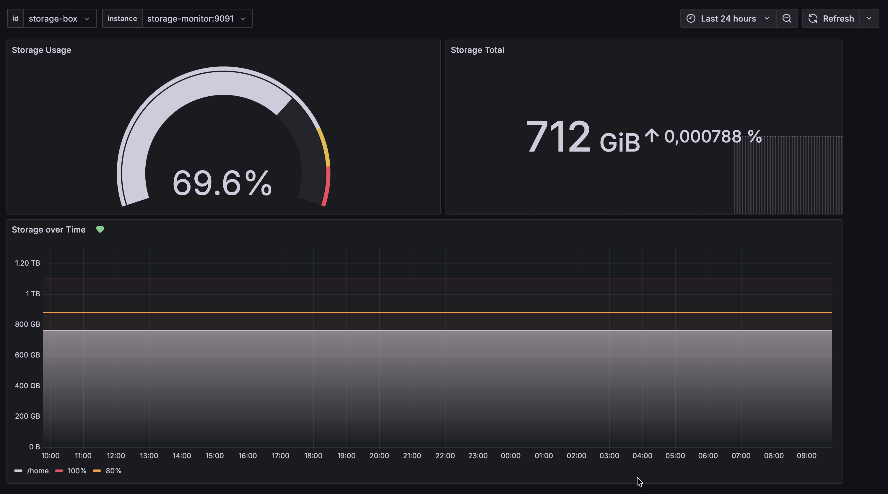

# ssh-storage-monitor

A simple service to monitor volumes of remote servers via SSH by exposing the output of `df` as metrics.

This service was originally designed to monitor the storage on a [Hetzner Storage Box](https://www.hetzner.com/storage/storage-box/).

## Usage

You can simply use the provided docker image to set up the service.

```yaml
services:
  ssm:
    build: .
    environment:
      SSM_BIND_ADDRESS: 0.0.0.0:9091
      SSM_LOG_LEVEL: info
      SSM_SERVERS: >-
        [
          {
            id=test-1,
            address=foo.example.com:22,
            username=foo,
            auth={
              password=foo
            }
          },
          {
            id=test-2,
            address=bar.example.com:22,
            username=bar,
            auth={
              private_key=/etc/ssh-keys/id_ed25519,
              public_key=/etc/ssh-keys/id_ed25519.pub,
            }
          }
        ]
    volumes:
      - "/home/foo/.ssh/id_ed25519:/etc/ssh-keys/id_ed25519:ro"
      - "/home/foo/.ssh/id_ed25519.pub:/etc/ssh-keys/id_ed25519.pub:ro"
    ports:
      - 19091:9091
```

You can also configure the service via a YAML or TOML file. The config file is either loaded from the current working directory when named `ssh-storage-monitor.*` or in your home config directory (i.e. `$HOME/.local/ssh-storage-monitor/config.*`). Alternatively, you can pass the config file location via command line arguments.

### Metrics

The metrics exposed via the `/metrics` endpoint look as following.

```
ssm_blocks{id="storage-box",address="u123456.your-storagebox.de:23",filesystem="u123456",mount="/home"} 1073495552
ssm_available{id="storage-box",address="u123456.your-storagebox.de:23",filesystem="u123456",mount="/home"} 326839040
ssm_used{id="storage-box",address="u123456.your-storagebox.de:23",filesystem="u123456",mount="/home"} 746656512
```

## Grafana Dashboard

[Here](config/grafana/dashboard.json) you can find a preset Grafana dashboard which I am using to monitor my personal remote storages.


